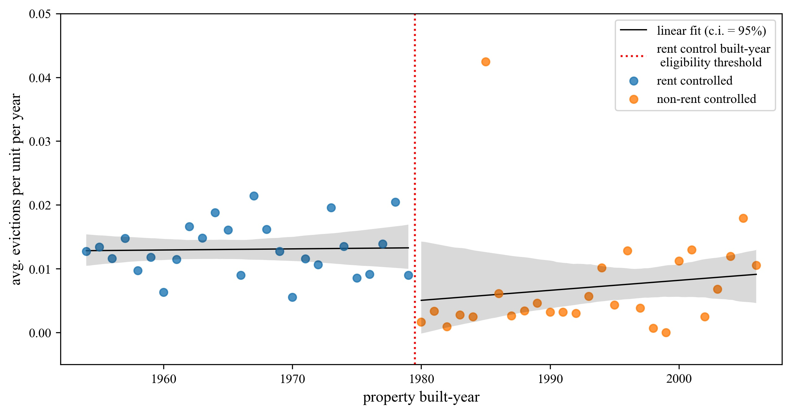
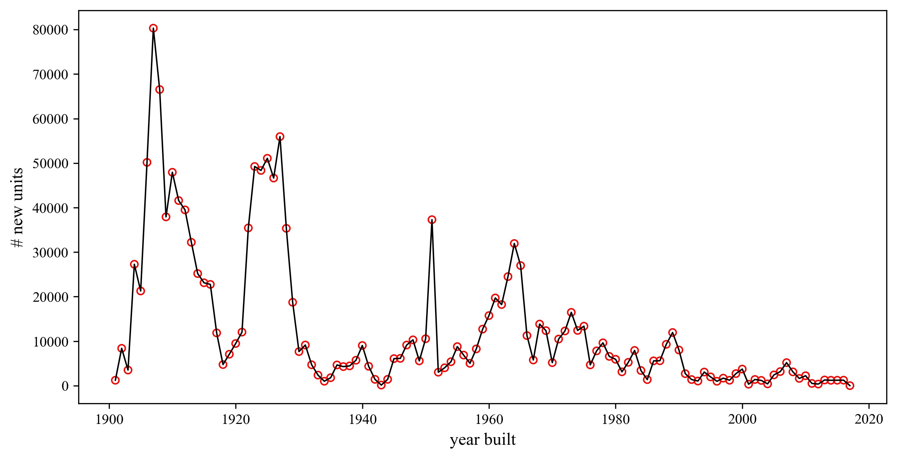

## The Causal Effect of San Francisco's Rent Control Ordinance on Eviction Rates

This paper presents causal evidence of a significant positive effect of rent control on eviction rates in San Francisco, CA. Using a publicly available dataset of eviction notices (n=21,806) and property tax records (n=1,978,687) filed between 2007 and 2016, I am able to estimate a local average treatment effect of ~1.3% evictions per residential unit per year conditioned on rent control status. Compared to the baseline rate of eviction notices over this same time period, the findings suggest that for a given tenant, positive rent control status (i.e., living in a rent-controlled unit) increases the likelihood of eviction by approximately 240% per year.

{:refdef: style="text-align: center;"}
{:height="75%" width="75%"}
*Regression Discontinuity*
{: refdef}

{:refdef: style="text-align: center;"}
{:height="75%" width="75%"}
*New construction of Multi-Unit Residential Buildings in San Francisco*
{: refdef}

{:refdef: style="text-align: center;"}
"){:height="75%" width="75%"}
*Distribution of Eviction Filings in Multi-Unit Buildings (2007 to 2016)*
{: refdef}

